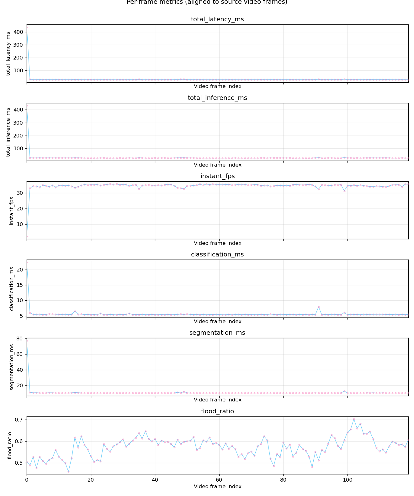
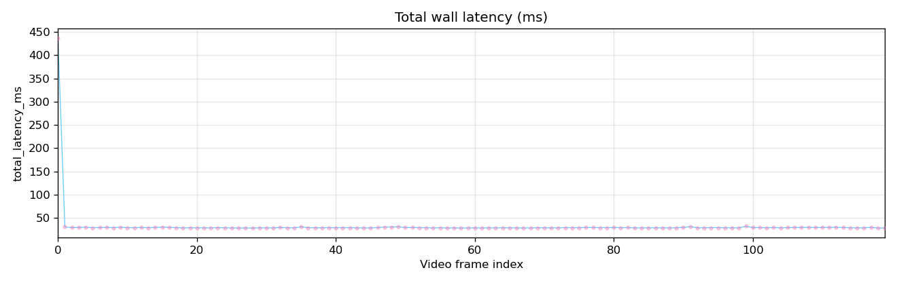
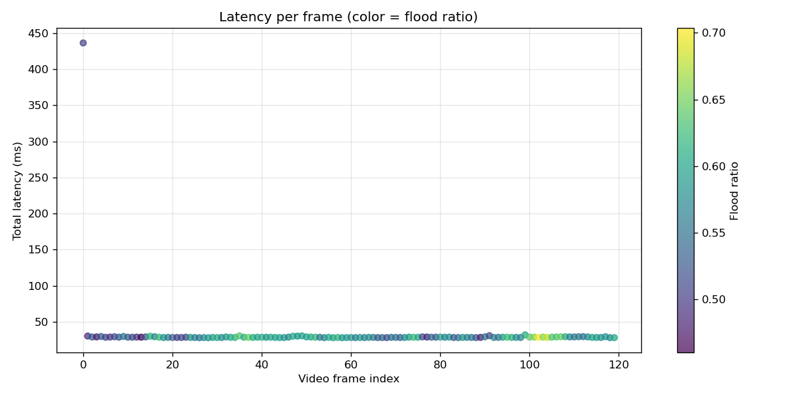

<!-- _class: lead -->
<!-- _paginate: false -->

# Model Server — Progress Report

### Context-Aware Adaptive Perception for Flood-Rescue UAVs

**Platform:** NVIDIA Jetson Orin · TensorRT · FastAPI
**Scope:** Onboard vision inference + adaptive model orchestration
**Status:** Working prototype — flood + human + combined rescue mode

---

## My role in the bigger picture

The full system is a multi-node stack. **I own the Model Server box.**

```
User prompt → Gateway → LLM (decides intent)
                 │
                 ├──► MODEL SERVER  ← (my scope: vision + model switch)
                 │
                 └──► Rule Gate → Drone Server (flight control)
                 ↓
               Reply
```

- **Upstream (not mine):** Gateway, LLM, user interface
- **Downstream (not mine):** Rule Gate, Drone Server, flight control
- **Mine:** deterministic, real-time perception + adaptive compute on the edge

---

## What the Model Server does

A self-contained perception service that starts **idle** and runs inference only when a tool is activated.

| Capability | Detail |
|------------|--------|
| **Flood classification** | ResNet18 — Flooded / Non-Flooded |
| **Flood segmentation** | DeepLabv3+ (MobileNetV3) — mask + flood ratio |
| **Human detection** | YOLOv8n — person bounding boxes |
| **Combined rescue mode** | Flood grid + humans on the same frame |
| **Localization** | Simulated GPS for flooded cell + each human |
| **Acceleration** | TensorRT engines, CUDA streams, FP16 |
| **Adaptation** | Context-aware model selection + smart segmentation |
| **Interfaces** | REST `/tool`, live `WS /ws/live`, dashboard |

---

## System architecture — adaptive pipeline

```
 Camera frame
     │
     ▼
┌──────────────────┐
│ Context Evaluator│  CPU/GPU/mem (real) + UAV/mission (sim)
└────────┬─────────┘
     ▼
┌──────────────────┐
│  Model Selector  │  Which model leads + run/skip segmenter
└────────┬─────────┘
     ▼
┌──────────────────┐
│  Model Manager   │  Lazy load + cache + TensorRT engines
└────────┬─────────┘
     ▼
┌──────────────────┐
│ Inference Engine │  Preprocess → infer → postprocess
└────────┬─────────┘
     ▼
┌──────────────────┐
│Performance Monitor│ FPS · latency · power · memory
└────────┬─────────┘
     ▼  outputs → dashboard / WebSocket / (future) ROS topics
```

---

## Node responsibilities (1/2)

**Task Session** — `core/task_session.py`
- Holds active tool state: `idle / detect_flood / detect_human / detect_combined`
- Entry point for Gateway/LLM via `POST /tool`; triggers warmup + inference

**Context Evaluator** — `core/context_evaluator.py`
- Collects system context: CPU, memory, GPU load (**real**)
- UAV/environment/mission context currently **simulated** (no flight controller yet)

**Model Selector** — `core/model_selector.py`
- Chooses **primary** model from flood ratio (ResNet18 ↔ DeepLabv3+)
- Gates the expensive segmenter on battery / CPU constraints

---

## Node responsibilities (2/2)

**Model Manager** — `core/model_manager.py`
- Lazy load, cache, unload/switch; picks TensorRT engine when available
- Falls back to PyTorch if an engine is missing

**Inference Engine** — `core/inference_engine.py`
- Pinned-memory preprocessing, FP16 autocast, CUDA-stream execution
- Stable output contract (label / mask+ratio / boxes) regardless of backend

**Performance Monitor** — `core/power_monitor.py`, metrics in payload
- FPS, latency, memory, CPU, Jetson power (tegrastats VDD_IN)

**Supporting:** `model_warmup`, `inference_gate` (single-flight GPU), `flood_grid` (GPS), `trt_runner`, `gpu_runtime` (CUDA streams)

---

## Live dashboard

A browser dashboard for operating and observing the server in real time.

- **Input source:** live camera **or** offline video upload
- **Task buttons:** Test flood · Test human · Test both · Stop
- **Live feed:** annotated frames over WebSocket (flood grid, human boxes)
- **Flood panel:** status, ratio, primary model, most-flooded-cell GPS
- **Human panel:** count + **per-person GPS** (bbox centroid)
- **Performance panel:** latency, FPS, memory, CPU
- **Power panel:** idle / inference / extra watts
- **Offline panel:** stride, altitude, export path → auto report + plots

---

## Offline benchmark — methodology

Goal: reproducible, **per-frame** evaluation on real flood footage.

- Upload video → run a tool → export per-video folder
- Outputs: **overlay MP4**, `metrics.csv` (one row/frame), plots, HTML/MD report
- Stride = 1 → genuine time series (no interpolation)
- 12 clips processed (archive, YouTube, drone rescue, synthetic)

**Chosen for deep analysis: `chittur_river_rescue` (combined mode)**

---

## Why `chittur_river_rescue` is the best clip to analyze

It is the only clip that **exercises the entire rescue pipeline at once**:

| Property | Value | Why it matters |
|----------|-------|----------------|
| Mode | `detect_combined` | Flood **and** human paths both active |
| Mean flood ratio | **0.57** (0.46–0.70) | Well above 0.20 → segmenter stays active |
| Mean humans/frame | **1.68** (1–3) | Multiple people → per-human GPS demo |
| Mean FPS | **34.5** | Highest sustained among combined+human clips |
| Steady p95 latency | **30.1 ms** | Tight, stable distribution |

> It represents the actual mission: *people stranded in flood water* — flood mapping + human localization simultaneously.

---

## Results — per-frame overview (chittur)



120 frames, combined mode, 50 m simulated altitude, stride 1.

---

## Results — latency breakdown (steady state)

| Stage | Mean (ms) | Backend |
|-------|-----------|---------|
| Classification (ResNet18) | **5.6** | TensorRT |
| Segmentation (DeepLabv3+) | **11.0** | TensorRT |
| Human + compose (YOLOv8n) | **~14.5** | TensorRT |
| **Total inference** | **31.2** | — |
| **Total latency** | **32.1** | end-to-end |

- **Steady-state:** mean 28.7 ms · p50 28.6 ms · **p95 30.1 ms**
- **Sustained ~34.5 FPS** in full combined mode on Jetson Orin
- Segmentation is the largest single cost — the reason adaptation targets it

---

## Tradeoff 1 — cold start vs steady state



- **First frame: 436 ms** vs steady **~29 ms**
- Cause: one-time model load + GPU warmup
  - clf 134 ms + seg 53 ms + human 3.4 ms = **191 ms**
- This single outlier inflates the **mean (32.1 ± 37.2 ms)**
- **Steady-state p95 is only 30 ms** — the true operating point
- **Takeaway:** warm up models before flight; report steady-state, not cold mean

---

## Tradeoff 2 — logical switch vs physical model swap

Switching strategy is the key design decision.

| Approach | Latency | Note |
|----------|---------|------|
| **Logical primary switch** | **0.016 ms** avg | Both models stay loaded; just change which leads |
| **Physical model swap** | **255 ms** | Unload classifier + load segmenter (worst case) |

- 36 switches over 50 steps cost **~0.016 ms each** — effectively free
- Physical swap is **~16,000× slower**
- **Decision:** keep both flood models resident, switch *logically* → no stutter
- Cost: higher VRAM (acceptable on Orin for 2 small models)

---

## Tradeoff 3 — smart segmentation (accuracy vs speed)

DeepLab is the most expensive stage, so we run it **only when needed**.

- **Policy:** skip segmentation when classifier says "dry" + periodic refresh + hysteresis
- **Dry scenes:** classifier-only path (~6 ms) instead of clf+seg (~17 ms)
- **Flood scenes (like chittur):** segmenter forced active → full accuracy
- **Tradeoff:** small risk of late flood onset detection, bounded by `SEG_INTERVAL` refresh
- **Net effect:** spend GPU budget where flood actually exists

---

## Tradeoff 4 — altitude vs resolution



- Higher altitude → **wider ground coverage** per frame
- But → **coarser pixels (GSD)** → small humans / flood edges shrink
- Lower altitude → sharper detail, less area, more passes needed
- Benchmark simulates altitude via resize to study this pre-flight
- **Implication:** choose altitude per mission (search wide vs inspect close)

---

## Resource usage (chittur, combined mode)

| Resource | Value |
|----------|-------|
| Memory (RSS) | **~1.22 GB** stable (no leak across 120 frames) |
| CPU | **~26%** mean (12–45%) |
| Flood ratio | 0.46–0.70 (consistently flooded scene) |
| Humans | 1–3 per frame |
| Power | *not captured in this offline run (tegrastats is live-only)* |

- Memory flat → clean lazy-load + cache, no per-frame allocation growth
- CPU headroom remains for the rest of the onboard stack

---

## Cross-video sanity check

Steady, predictable behavior across very different footage:

| Video | Frames | FPS | p95 ms | Flood | Humans |
|-------|--------|-----|--------|-------|--------|
| **chittur_river_rescue** | 120 | 34.5 | 30.1 | 0.57 | 1.68 |
| kherson_drone_rescue | 1033 | 37.4 | 28.8 | 0.31 | 0.0 |
| archive_flood_airfield | 2177 | 21.8 | 55.5 | 0.34 | 0.02 |
| archive_flood_1955 | 485 | 26.9 | 50.0 | 0.73 | 0.0 |
| youtube_cumbria_rescue | 377 | 23.0 | 59.0 | 0.15 | 2.29 |

> Higher-res / busier clips cost more per frame, but the pipeline stays stable (no crashes, no memory growth) over 2000+ frame runs.

---

## Key takeaways

- **Real-time on the edge:** ~34 FPS, p95 30 ms in full combined rescue mode
- **Adaptation works:** logical switching is free; smart segmentation saves the most expensive stage
- **Stable:** flat memory, tight latency over long runs
- **Honest scope:** UAV state + GPS are **simulated**; vision + compute adaptation are **real**
- **Clean boundaries:** behaves as a drop-in perception node for the Gateway/LLM stack

---

## Limitations & next steps

**Current limitations**
- Lightweight test weights (not trained on heavy datasets) → results validate the *pipeline*, not operational accuracy
- UAV context (battery/altitude/GPS) simulated; power not logged offline
- One model per task slot

**Planned**
1. Real context schema + mission-linked policy + decision logging
2. Closed loop: Performance Monitor → Model Selector (auto-degrade under load)
3. Model registry + second-tier models (MobileNetV2, UNet-Light, YOLOv8s)
4. Flight integration (Pixhawk/ROS 2) for real GPS — interface-first

---

<!-- _class: lead -->
<!-- _paginate: false -->

# Thank you

**Model Server** — adaptive, real-time, edge perception for flood-rescue UAVs

Repo: `github.com/aykumar21/Drone_LLM`
Stack: Python · FastAPI · PyTorch · TensorRT · CUDA · YOLOv8 · Jetson Orin
